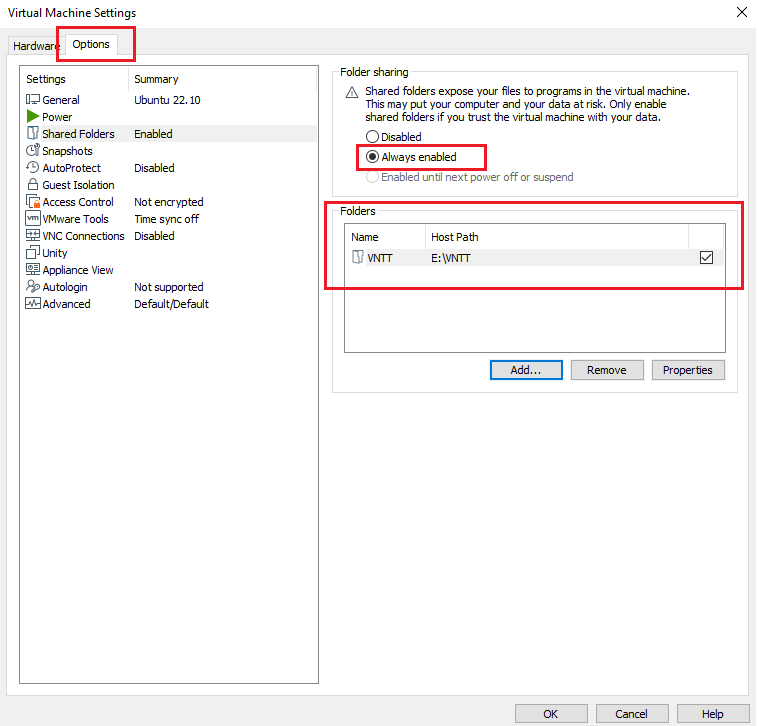

# VMWare

## Ubuntu

### Share folders between host and VM

Open **Virtual Machine Settings** > **Options** and click **Add** to add shared folders



Run the following command

```shell
# Checking shared folders
vmware-hgfsclient

# Create folder if not exist
sudo mkdir -p /mnt/hgfs

# Edit file 
sudo nano /etc/fstab
```

Add the following line at the end of the **/etc/fstab** file to automatically mount the VMware share on boot. Please check **uid**, **gid**

```shell title="/etc/fstab"
# Use shared folders between VMWare guest and host
.host:/    /mnt/hgfs    fuse.vmhgfs-fuse    defaults,allow_other,uid=1000,gid=1000     0    0
```

Run `sudo reboot` or `sudo mount -a`

### Install SSH

```shell
sudo apt install openssh-server -y

sudo service ssh status
sudo ufw allow ssh

sudo ufw enable && sudo ufw reload
```

Disable SSH

```shell
sudo ufw disable && sudo ufw reload
```

### Install Docker

```shell
# Set up the repository
sudo apt-get update -y

sudo apt-get install -y \
    ca-certificates \
    curl \
    gnupg
    
sudo mkdir -m 0755 -p /etc/apt/keyrings
curl -fsSL https://download.docker.com/linux/ubuntu/gpg | sudo gpg --dearmor -o /etc/apt/keyrings/docker.gpg

echo \
  "deb [arch="$(dpkg --print-architecture)" signed-by=/etc/apt/keyrings/docker.gpg] https://download.docker.com/linux/ubuntu \
  "$(. /etc/os-release && echo "$VERSION_CODENAME")" stable" | \
  sudo tee /etc/apt/sources.list.d/docker.list > /dev/null
  
  
# Install Docker Engine
sudo apt-get update -y
sudo apt-get install -y docker-ce docker-ce-cli containerd.io docker-buildx-plugin docker-compose-plugin

# Setup perms
sudo usermod -aG docker $USER
newgrp docker
```
