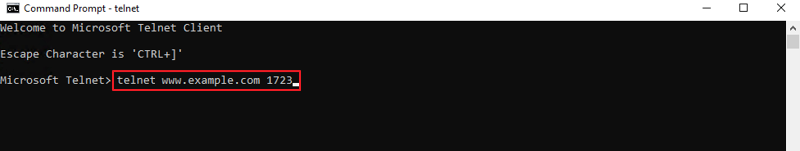
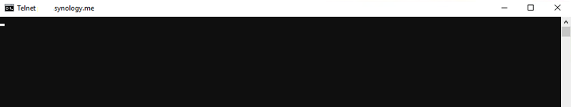
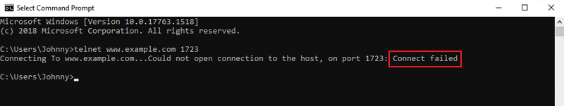

# Get Started

## Tips
### Install Makefile


### Check available port
1. Press the **Windows key** and type "Windows features" in the search bar. Then, select **Turn Windows features on or off**
2. Tick the **Telnet Client** checkbox and click OK.


3. Press the **Windows key + R**, then type "cmd.exe" and click OK.
4. Enter "telnet + IP address or hostname + port number" (e.g., telnet www.example.com 1723 or telnet 10.17.xxx.xxx 5000) to run the telnet command in **Command Prompt** and test the TCP port status.



5. If the port is open, only a cursor will show



If the port is closed, a message will say Connect failed.



### Kill port
```shell
# Method 1
netstat -ano | findstr :<PORT>
taskkill /PID <PID> /F

# Method 2
npx kill-port <PORT>
```

## Popular
