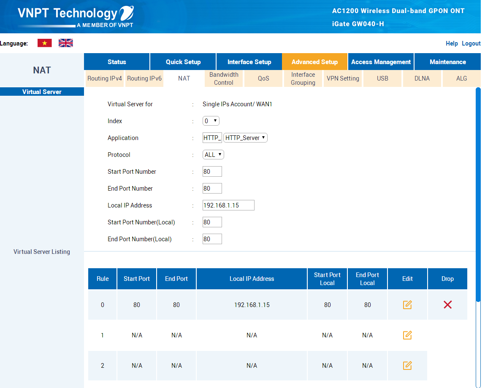

# PC

## Setup Network
### Configure static IP address
Open Network status and get network name


Run cmd `ipconfig` and find network by name


From Network Status, choose Properties 


Setup Manual IP


### Register free domain and DNS 

Service Providers: 
- [dyndns.org](http://dyndns.org)
- [tzo.net](http://tzo.net)
- [zoneedit.com](http://zoneedit.com)
- [dhs.org](http://dhs.org)
- [ez-ip.net](http://ez-ip.net)
- [easydns.com](http://easydns.com)
- [no-ip.com](http://no-ip.com)

#### NoIP
Login to your No-IP account.

Create a hostname (example: laragis.ddns.net). This hostname will be the URL you will use to connect to your device
  from anywhere.

Download and Install the [Dynamic Update Client (DUC)](https://www.noip.com/download?page=win).

After installation, you will need to login to the DUC and [configure it to update the hostname you added](https://www.noip.com/support/knowledgebase/installing-the-windows-4-x-dynamic-update-client-duc/?utm_campaign=getting-started&utm_medium=notice&utm_source=email)

If you are behind a router or firewall, you will need to open and forward the correct ports for the services you wish to run


Open `https://dns.google` and enter `laragis.ddns.net`

 

Open URL to check IP `https://ping.eu/ping/`

### Configure NAT Port (Port Forwarding) - VNPT Modem
Download [UCBrower](https://ucbrowser.io/). VNPT blocked Google Chrome,... to access modem, ony used by UCBrower

Open URL: `192.168.1.1` and enter account info (`admin / Passwd2@`).

:::caution

If you don't have account, please call VNPT phone 18001166 and enter 1 number

:::

Open **Asset Management** > **DDNS** to update NoIP Account


Open **Advanced Setup** > **NAT** to NAT port. You can get Interface by **Open Status** > **Device Info** > Interface: WAN1


NAT Port. Enter all input

:::info

Local IP Address: LAN IP Address

:::



Run cmd 

```shell
docker run --name docker-nginx -p 80: 80 -d nginx
```

Open URL to check port `https://ping.eu/port-chk/`


